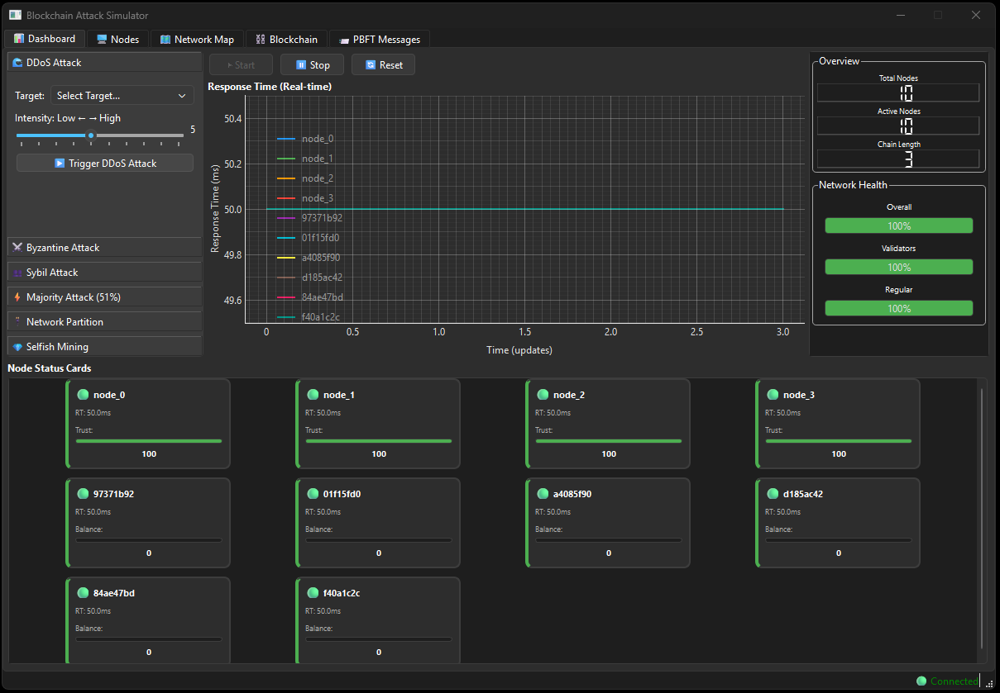
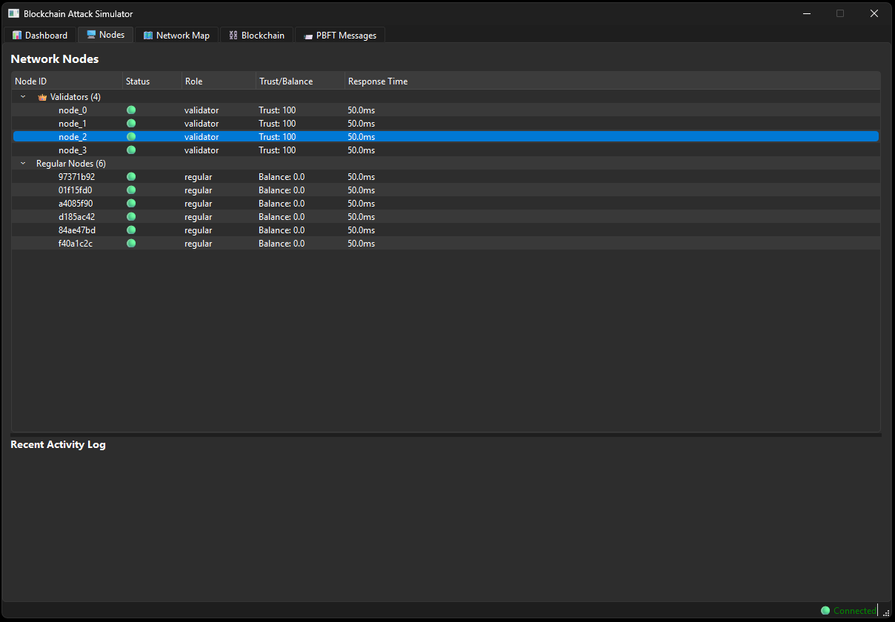
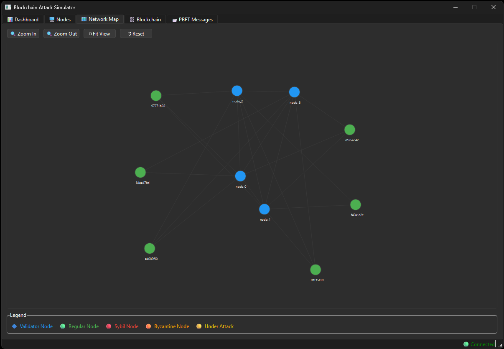
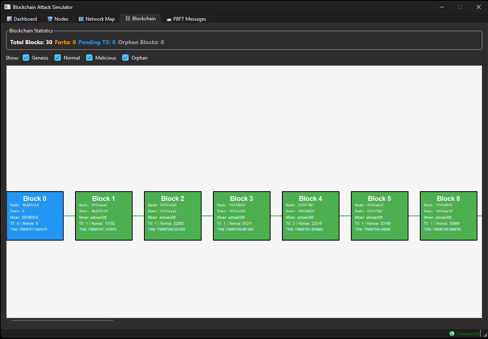

# 🔐 Interactive Blockchain Attack Simulator

Blockchain ağlarının çeşitli saldırı senaryoları karşısındaki davranışlarını gerçek zamanlı olarak görselleştiren eğitim ve demo amaçlı interaktif simülatör.

## 📖 Genel Bakış

Interactive Blockchain Attack Simulator, blockchain teknolojisi ve güvenliği konusunda eğitim almak isteyen geliştiriciler, siber güvenlik uzmanları ve öğrenciler için geliştirilmiş kapsamlı bir simülasyon platformudur. Bu proje, blockchain ağlarında gerçekleşebilecek saldırıları güvenli bir ortamda deneyimlemenizi ve etkilerini gerçek zamanlı olarak gözlemlemenizi sağlar.

### 🎯 Temel Amaçlar

- **Eğitim:** Blockchain güvenlik kavramlarının görsel ve interaktif öğrenimi
- **Demo:** Profesyonel sunumlar için hazırlanmış etkileyici simülasyon senaryoları
- **Araştırma:** Saldırı etkilerinin detaylı analizi ve sistem dayanıklılık testleri

## ✨ Özellikler

### 🔗 Blockchain Özellikleri
- **Proof of Work (PoW)** ile mining
- **PBFT (Practical Byzantine Fault Tolerance)** konsensüs mekanizması
- Multi-node ağ simülasyonu (10 node: 4 validator, 6 regular)
- RSA 2048-bit kriptografi
- Fork detection ve resolution
- Otomatik blok üretimi

### ⚔️ Saldırı Senaryoları

1. **DDoS Saldırısı**
   - Hedef node'a yoğun istek bombardımanı
   - Response time artışı ve performans düşüşü
   - Gerçek zamanlı metrik etkileri

2. **Byzantine Node Saldırısı**
   - Validator node'un hatalı davranışı
   - PBFT konsensüs sürecinde aksama
   - Trust score sisteminin devreye girmesi

3. **Sybil Saldırısı**
   - Çok sayıda sahte node oluşturma (5-50 node)
   - Ağ manipülasyonu denemeleri
   - Network map'te görsel işaretleme

4. **%51 Saldırısı (Majority Attack)**
   - Validator'ların %51'ini ele geçirme
   - Fork oluşturma ve çift harcama
   - Blockchain reorganizasyonu

5. **Network Partition**
   - Ağı ikiye bölme (Group A ve Group B)
   - Paralel zincir oluşumu
   - Merge ve en uzun zincir kuralı

6. **Selfish Mining**
   - Private chain tutma stratejisi
   - Public chain'den önde kalma
   - Reveal ve kazanç manipülasyonu

### 📊 Görselleştirme ve İzleme

#### PySide6 Frontend (Desktop App)
- Native Qt application
- Professional UI/UX
- QDockWidget sistemi (customizable layout)
- PyQtGraph ile real-time grafik
- NetworkX tabanlı network visualization
- Standalone executable (.exe)
- Daha yüksek performans

## 🛠️ Teknoloji Stack

### Backend
- **FastAPI** - Async REST API framework
- **Python 3.10+** - Core language
- **Asyncio** - Asenkron operasyonlar
- **Cryptography** - RSA, SHA256

### Frontend (Streamlit)
- **Streamlit** - Web UI framework
- **Plotly** - Interactive charts
- **streamlit-agraph** - Network visualization
- **Pandas** - Data manipulation

### Frontend (PySide6) ⚡ **YENİ**
- **PySide6 (Qt 6)** - Desktop UI framework
- **PyQtGraph** - Real-time plotting
- **NetworkX** - Graph algorithms
- **QThread** - Background processing

### Testing
- **pytest** - Test framework
- **pytest-asyncio** - Async test support
- **unittest.mock** - Mocking

## 📋 Gereksinimler

### Sistem Gereksinimleri
- Python 3.10 veya üzeri
- 4GB RAM (minimum)
- 500MB disk alanı

### Python Bağımlılıkları

#### Backend
```
fastapi>=0.104.0
uvicorn>=0.24.0
pydantic>=2.4.0
cryptography>=41.0.0
```

#### Frontend (Streamlit)
```
streamlit>=1.28.0
plotly>=5.17.0
pandas>=2.1.0
requests>=2.31.0
streamlit-agraph>=0.0.45
```

#### Frontend (PySide6)
```
PySide6>=6.5.0
pyqtgraph>=0.13.0
networkx>=3.0
requests>=2.31.0
```

## 💻 Kullanım

### Backend API'yi Başlatma

```bash
cd backend
python main.py
```

API varsayılan olarak `http://localhost:8000` adresinde çalışır.

- API Dökümantasyonu: `http://localhost:8000/docs`
- ReDoc: `http://localhost:8000/redoc`

### Streamlit Frontend'i Başlatma

```bash
# Yeni bir terminal açın
cd frontend-streamlit
streamlit run main.py
```

Streamlit arayüzü `http://localhost:8501` adresinde açılacaktır.

### PySide6 Frontend'i Başlatma ⚡

```bash
# Yeni bir terminal açın
cd frontend-PySide6
python main.py
```

Native desktop uygulaması açılacaktır.

### Hızlı Başlangıç

1. Backend API'yi başlatın
2. Frontend'lerden birini başlatın (Streamlit veya PySide6)
3. "▶️ Start" butonuna basarak simülasyonu başlatın
4. Sol panelden bir saldırı senaryo seçin ve tetikleyin
5. Gerçek zamanlı etkileri dashboard ve grafiklerde gözlemleyin

## 🎮 Saldırı Senaryoları Kullanımı

### DDoS Saldırısı

1. Attack Panel'den "DDoS Attack" seçin
2. Hedef node'u seçin
3. Intensity (1-10) ayarlayın
4. "Trigger Attack" butonuna basın
5. Metrics Dashboard'da response time artışını gözlemleyin

### Byzantine Saldırısı

1. "Byzantine Attack" seçin
2. Bir validator node seçin (sadece validator'lar)
3. "Trigger Attack" butonuna basın
4. PBFT mesaj trafiğinde anormallikleri gözlemleyin
5. Validator'ın trust score'unun düştüğünü görün

### Sybil Saldırısı

1. "Sybil Attack" seçin
2. Fake node sayısını ayarlayın (5-50)
3. "Trigger Attack" butonuna basın
4. Network Map'te kırmızı sahte node'ları görün
5. Ağ topolojisindeki değişimi izleyin

### %51 Saldırısı

1. "Majority Attack (51%)" seçin
2. "Trigger Attack" butonuna basın
3. Blockchain Explorer'da fork oluşumunu görün
4. Malicious validator'ların etkisini izleyin

### Network Partition

1. "Network Partition" seçin
2. "Trigger Attack" butonuna basın
3. Network Map'te iki grubun ayrıldığını görün
4. Paralel zincir oluşumunu izleyin
5. Merge sonrası orphan blokları gözlemleyin

## 📁 Proje Yapısı

```
BlockChainAgSimulasyon/
├── backend/                      # FastAPI Backend
│   ├── main.py                   # API server entry point
│   ├── simulator.py              # Network simulator
│   ├── core/                     # Blockchain core
│   │   ├── transaction.py        # Transaction logic
│   │   ├── wallet.py             # Wallet management
│   │   ├── block.py              # Block structure
│   │   └── blockchain.py         # Blockchain logic
│   ├── network/                  # Network layer
│   │   ├── node.py               # Node implementation
│   │   ├── message_broker.py    # Message passing
│   │   └── pbft_handler.py      # PBFT consensus
│   └── attacks/                  # Attack scenarios
│       ├── attack_engine.py      # Attack management
│       ├── ddos.py               # DDoS attack
│       ├── byzantine.py          # Byzantine attack
│       ├── sybil.py              # Sybil attack
│       ├── majority_attack.py   # 51% attack
│       ├── network_partition.py # Network partition
│       └── selfish_mining.py    # Selfish mining
├── frontend-PySide6/             # Qt Desktop UI
│   ├── main.py                   # Application entry
│   ├── core/                     # Core logic
│   │   ├── api_client.py         # Backend client
│   │   ├── data_manager.py       # Data management
│   │   └── updater.py            # Real-time updater
│   ├── ui/                       # UI components
│   │   ├── main_window.py        # Main window
│   │   ├── pages/                # Tab pages
│   │   │   ├── dashboard_page.py
│   │   │   ├── nodes_page.py
│   │   │   └── network_page.py
│   │   └── widgets/              # Custom widgets
│   │       ├── metrics_widget.py
│   │       ├── node_status_card.py
│   │       ├── attack_panel_widget.py
│   │       ├── active_attack_item.py
│   │       └── network_graph_widget.py
│   └── tests/                    # Unit tests
├── config.py                     # Global configuration
├── requirements.txt              # Python dependencies
└── Doküman/                      # Documentation
    ├── Projenin Ne Olduğu
    ├── Projenin Nasıl Olacağı
    ├── Yol Haritası.md
    ├── Tamamlanan Özellikler.md
    ├── PySide6 UI Planlama.md
    └── UI_YAPILAN_ISLEMLER.md
```

## 📸 Ekran Görüntüleri

### Dashboard
*Gerçek zamanlı sistem metrikleri, PBFT status*



### Network Nodes
*Network Node'lerin detaylı görünümü ve aktivite logları*



### Network Map
*Interactive network topology görselleştirmesi, node durumları ve bağlantılar*



### Blockchain Explorer
*Zincir görünümü, fork gösterimi, ve blok detayları*



### PBFT Messages
*PBFT Messaga listesi*


## 🗺️ Yol Haritası

### ✅ Tamamlanan Milestone'lar

- [x] **Milestone 1:** Minimal Çalışan Sistem (Blockchain Core, API, UI)
- [x] **Milestone 2:** PBFT Consensus (Message Broker, PBFT Handler)
- [x] **Milestone 3:** İlk Saldırı - DDoS (Attack Engine, Metrics)
- [x] **Milestone 4:** Byzantine Node Saldırısı (Trust Score)
- [x] **Milestone 5:** Sybil Saldırısı (Network Visualizer)
- [x] **Milestone 6:** %51 Saldırısı (Fork Handling, Blockchain Visualizer)
- [x] **Milestone 7:** Network Partition (Partition Resolution, Merge)
- [x] **PySide6 UI:** Desktop frontend (Metrics Dashboard, Attack Panel, Network Map)

**Not:** Bu proje eğitim ve araştırma amaçlıdır. Gerçek blockchain ağlarında kullanılmamalıdır.